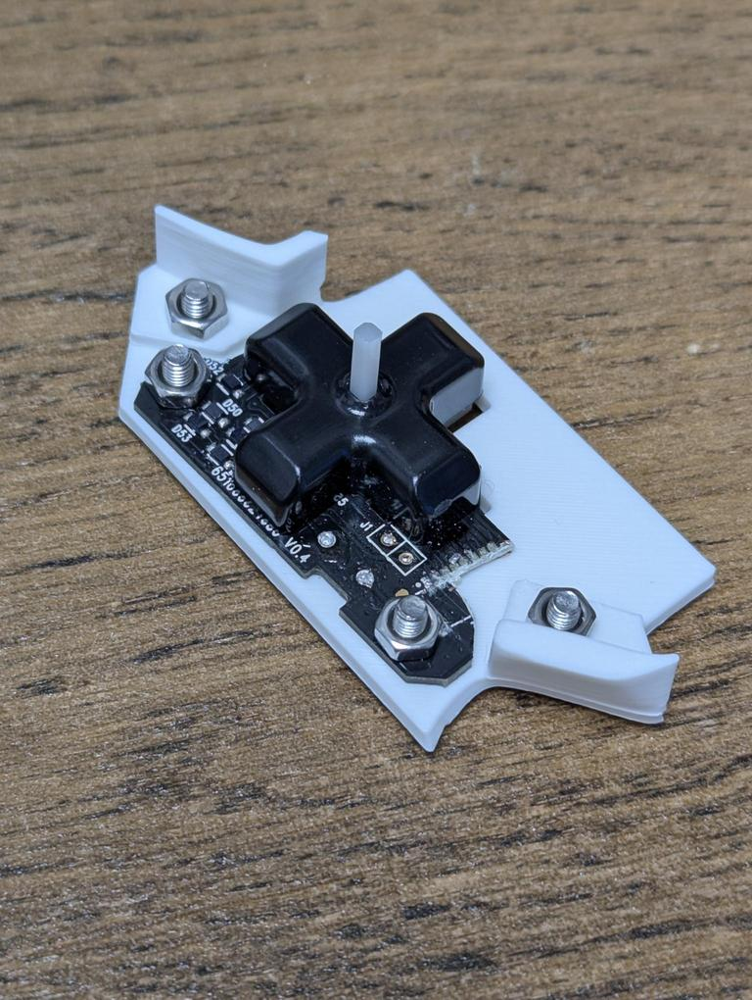
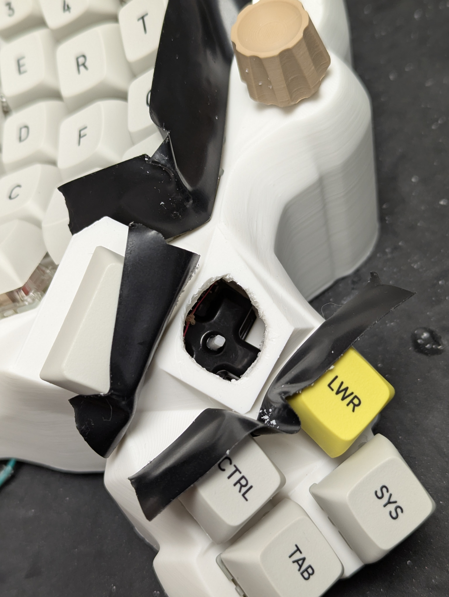
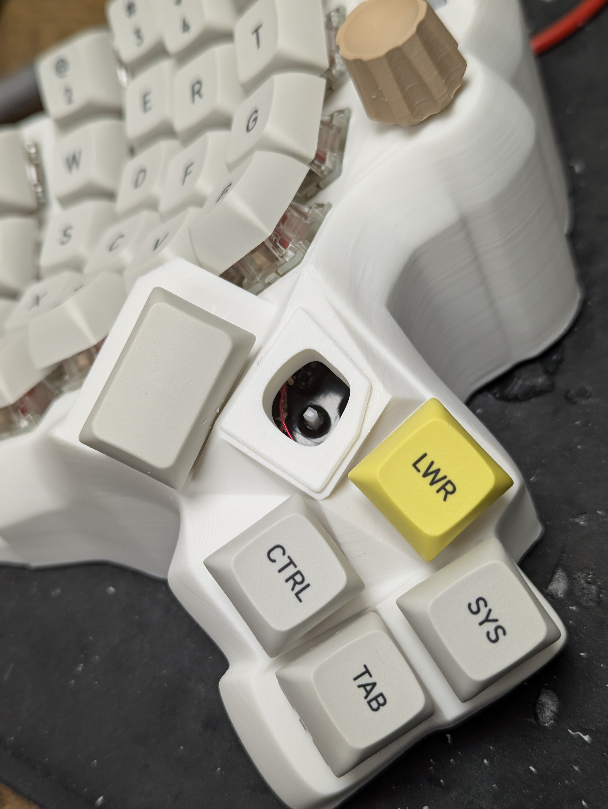
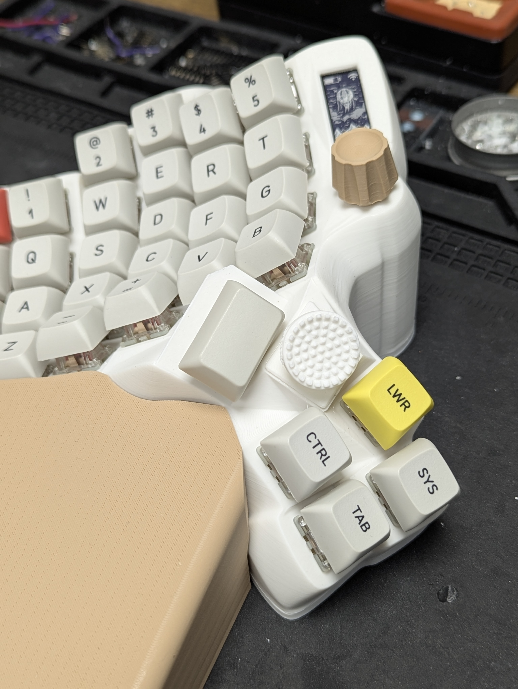

# DPAD

The dpad, as configured here by cosmos, is not very good. The ALPS 5 way switch is not suitable for gaming use. It is very mushy and cannot do diagonal directions properly.

I was not satisfied with this, so I decided to do some custom modifications. I had an older Razer Tartarus Chroma that I am not using anymore, so I harvested the dpad PCB from it. I then modeled a custom holder for it.

I chopped up the PCB to get it to fit, but this does not matter since I am soldering directly to the switches. Here it is mounted into the keyboard.

What is not shown here is that I later added washers to raise the PCB further, since reducing the length of the joystick stem reduces the side to side travel of it. I had to dremel out an ugly hole.

And then make it slightly less ugly.

Then insert the joystick. I modified [this model](https://www.thingiverse.com/thing:5578390) for my purposes. All the STL files I used are included in this repo. The cover for the dpad hole is a bit specific though, since it follows the shape of the hole I dremeled (not sure why I did that).

I would say that this is about 85% as good as the original dpad from the Tartarus Chroma I havested this from. This is mainly due to the increased side-to-side travel required to press the switches.

I think it should be possible to do this without harvesting anything like I did, using only mouse switches (mouse switches are what is used on the PCB). I only really used the PCB as a holder for the switches. Someone would have to model a holder, as well as the other mechanical components I harvested as shown in the first image. Strength might be a problem for printed parts though. I originally printed a replacement for the white plastic stem piece and it always broke on me.