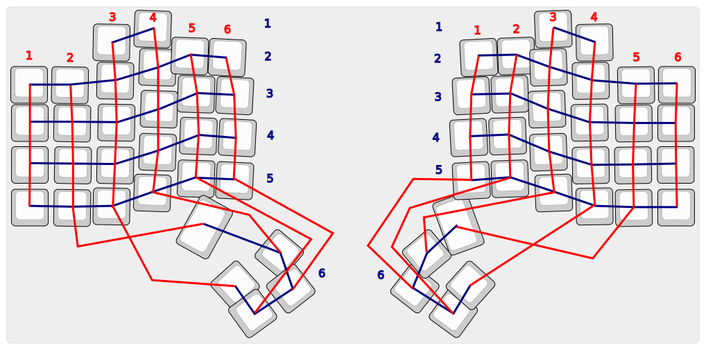

# Dmhuisma Keyboard ZMK Module

This is my ZMK module for the split keyboard I generated with the [Cosmos keyboard generator](https://ryanis.cool/cosmos/).

The cosmos generator configuration is saved in the URL, here is [my configuration](https://ryanis.cool/cosmos/beta#cm:CtgBChUSBRCAbyAnEgASABIAOB5AgIaLoAIKGxIFEIBjICcSABIAEgMQsDsSAxCwazgKQIDgTQodEgUQgFcgJxIAEgASAxCwLxIDELBfOAlAgICKiAMKDxIFEIBLICcSABIAEgA4HQoPEgUQgD8gJxIAEgASADgxCigSEhBAICdAqI6HmAZIs5H0vOHQARIOCBNAk/YWSLmdlK3hvgUwHThFCigSCCAnYgRURVJNEgMQkHcSBBCgzgoSCRAwYgVTSElGVDgyQICGi6ACGABArpCX+CpI0oeA1qAPCpwBCn0SGAiAMBDAgAIYACAAQIuF2JYQSI2FgMDdDRIYCJawggEQQCAAQN6DsLSADEjVl8zt4NcFEg8gAECthdwDSJmJhJ7g3BASECAAQOKD2NABSOmTnJeg8BESDyAAQM/ijzhIg4+cl6C9EhIRIABA8IW8l7ABSOGdzI3A2BI4ABgCIgoIyAEQyAEYACAAQNeRzKzwM0imqeDG8LMICs0BChUSBRCAAyAnEgASABIAOB1AgIaLoAIKFRIFEIAPICcSABIAEgASADgJQIDgTQoXEgUQgBsgJxIAEgASABIAOApAgICKiAMKDxIFEIAnICcSABIAEgA4HgoPEgUQgDMgJxIAEgASADgyCikSEhBAICdAp46HmAZIs5H4vNHQARIPCBtAgKqO+ARIpZHQvYF2MB04RgooEgcgJ2IDRVNDEgQQkMABEgQQoIAKEgkQMGIFU0hJRlQ4MUCAhougAhgBQK2Ql/gqSNKH/NWQDwq4AQqYARIVCBwQQCAAQISF0JawDEjBh4y8gNkfEhgIgDAgAECZ+JYISISPgLCsAWIFU3BhY2USGBBAIABAroXcA0iZiYie0NwQYgVNT1VTRRIXEEAgAEDhg9jQAUjpk6CXkPARYgNUQUISFxBAIABA0OKPOEiDj6CXkL0SYgRNRVRBEhcQQCAAQO+FvJewAUiFn9CNsNgSYgJGTjgAGAMiCgjIARDIARgAIABA2JHMrPAzSKap3MaAtAgYjaACggEBAlhIYANoAHIGKEY4CkAyeJO6x+gB). It also provides the BOM for this keyboard, I only added the MCP23017 GPIO expander board.

## Features
- Ergonomic
    - Split
    - Concave key well
    - Thumb clusters
    - Staggered to accommodate my hand/finger sizes
- Wireless
- Trackball mouse movement
- Displays
- Hotswappable keys
- Multiple potentiometers (one with directional clicking) for media controls, mouse scrolling, etc.
- Dpad for cursor navigation or gaming

## TODO

- finish ZMK module, lots of it is currently placeholder
- features list
- add image of finished keyboard
- update cosmos link with final config

## Building

The firmware is built by Github actions on every commit. It can also be built with a local install of ZMK with the following commands.

> west build -p auto -d build/left -b nice_nano_v2 -- -DZMK_EXTRA_MODULES="[path to module]/dmhuisma-keyboard-zmk-module" -DSHIELD=dmhuisma_left

> west build -p auto -d build/right -b nice_nano_v2 -- -DZMK_EXTRA_MODULES="[path to module]/dmhuisma-keyboard-zmk-module" -DSHIELD=dmhuisma_right

## Keyscan Matrix

## Pinout

This keyboard uses the [nice!nano V2](https://nicekeyboards.com/nice-nano/) on each side. However, there is not enough GPIO pins for this keyboard, so it also uses an MCP23017 GPIO expander.

### Left Keyboard

#### Nice!Nano V2 Left Side GPIO
|                       |                                               |
|-----------------------|-----------------------------------------------|
|GND                    |RKJXT1F42001 GND|
|**[D1]** P0.06         |RKJXT1F42001 Encoder A|
|**[D0]** P0.08         |RKJXT1F42001 Encoder B|
|GND                    |NiceView GND|
|GND                    |MCP23017 GND|
|**[D2]** P0.17         ||
|**[D3]** P0.20         |MCP23017 RESET|
|**[D4]** P0.22         |MCP23017 SCL|
|**[D5]** P0.24         |MCP23017 SDA|
|**[D6]** P1.00         |NiceView MOSI|
|**[D7]** P0.11         |NiceView SCK|
|**[D8]** P1.04         |NiceView CS|
|**[D9]** P1.06         |MCP23017 INT|

#### Nice!Nano V2 Right Side GPIO
|                       |                                               |
|-----------------------|-----------------------------------------------|
|Battery+               ||
|Battery+               ||
|GND                    |SKQU GND|
|Reset                  ||
|3.3V Vcc               |NiceView Vcc, MCP23017 Vcc|
|**[D21]** P0.31 (ADC)  ||
|**[D20]** P0.29 (ADC)  ||
|**[D19]** P0.02 (ADC)  ||
|**[D18]** P1.15        |SKQU up|
|**[D15]** P1.13        |SKQU down|
|**[D14]** P1.11        |SKQU left|
|**[D16]** P0.10        |SKQU right|
|**[D10]** P0.09        |SKQU center|

#### Nice!Nano V2 Back GPIO
|                       |                                               |
|-----------------------|-----------------------------------------------|
|P1.01                  ||
|P1.02                  ||
|P1.07                  ||

#### MCP23017 GPIO
|                       |                                               |
|-----------------------|-----------------------------------------------|
|PA0                    |Row 1|
|PA1                    |Row 2|
|PA2                    |Row 3|
|PA3                    |Row 4|
|PA4                    |Row 5|
|PA5                    |Row 6|
|PA6                    |Column 1|
|PA7                    |Column 2|
|PB0                    |Column 3|
|PB1                    |Column 4|
|PB2                    |Column 5|
|PB3                    |Column 6|
|PB4                    ||
|PB5                    ||
|PB6                    ||
|PB7                    ||

### Right Keyboard

#### Nice!Nano V2 Left Side GPIO
|                       |                                               |
|-----------------------|-----------------------------------------------|
|GND                    |PMW3610 GND|
|**[D1]** P0.06         |PMW3610 MOSI|
|**[D0]** P0.08         |PMW3610 MISO|
|GND                    |NiceView GND|
|GND                    |MCP23017 GND|
|**[D2]** P0.17         |PMW3610 SCK|
|**[D3]** P0.20         |MCP23017 RESET|
|**[D4]** P0.22         |MCP23017 SCL|
|**[D5]** P0.24         |MCP23017 SDA|
|**[D6]** P1.00         |NiceView MOSI|
|**[D7]** P0.11         |NiceView SCK|
|**[D8]** P1.04         |NiceView CS|
|**[D9]** P1.06         |MCP23017 INT|

#### Nice!Nano V2 Right Side GPIO
|                       |                                               |
|-----------------------|-----------------------------------------------|
|Battery+               ||
|Battery+               ||
|GND                    |EVQWGD001 GND|
|Reset                  ||
|3.3V Vcc               |NiceView Vcc, MCP23017 Vcc, PMW3610 Vcc|
|**[D21]** P0.31 (ADC)  ||
|**[D20]** P0.29 (ADC)  ||
|**[D19]** P0.02 (ADC)  ||
|**[D18]** P1.15        ||
|**[D15]** P1.13        ||
|**[D14]** P1.11        |EVQWGD001 Encoder A|
|**[D16]** P0.10        |EVQWGD001 Encoder B|
|**[D10]** P0.09        |EVQWGD001 Button|

#### Nice!Nano V2 Back GPIO
|                       |                                               |
|-----------------------|-----------------------------------------------|
|P1.01                  ||
|P1.02                  ||
|P1.07                  ||

#### MCP23017 GPIO
|                       |                                               |
|-----------------------|-----------------------------------------------|
|PA0                    |Row 1|
|PA1                    |Row 2|
|PA2                    |Row 3|
|PA3                    |Row 4|
|PA4                    |Row 5|
|PA5                    |Row 6|
|PA6                    |Column 1|
|PA7                    |Column 2|
|PB0                    |Column 3|
|PB1                    |Column 4|
|PB2                    |Column 5|
|PB3                    |Column 6|
|PB4                    ||
|PB5                    ||
|PB6                    ||
|PB7                    ||

### Nice!Nano V2 pinout for reference

### MCP23017 pinout for reference

This is for the board I used, any other one should also work.

