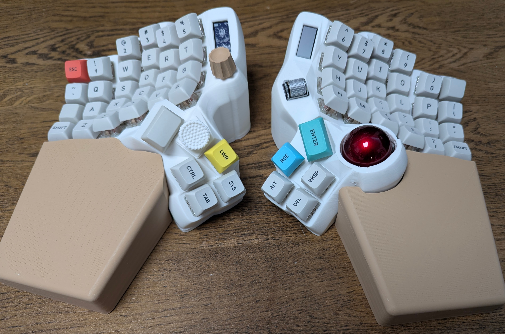

# Dmhuisma Keyboard ZMK Module

This is my ZMK module for the split keyboard I generated with the [Cosmos keyboard generator](https://ryanis.cool/cosmos/). This is version 2 of the keyboard ([version 1](https://github.com/dmhuisma/dmhuisma-keyboard-zmk-module/tree/v1) is shown in the image below as I have not built it yet). After I built [Splitcore](https://github.com/dmhuisma/splitcore-zmk) I found that I never used this one, so I decided to repurpose its parts into something new.

The cosmos generator configuration is saved in the URL, here is [my configuration](https://ryanis.cool/cosmos/beta#cm:CpMCCiISCBCAbyAniAEUEgIgExICIAASA4gBCjgeQICmi4AFSLMDCisSChCAYyAnQASIARQSAiATEgIgABIDELA7EggQsGsgKIgBDzgKQIC0XUgACikSCQgNEIBXICdIABICIBMSAiAAEgMQsC8SBRCwXyAoOAlAgNSG2AJIAAoWEggQgEsgJ4gBMhICIBMSAiAAEgA4HQocEggQgD8gJ4gBMhICIBMSAiAAEgIIASICKAA4MQo1EgggJ2IEVEVSTRIFEJB3IBMSBhCgzgogABIMEDBiBVNISUZUiAEUODJAktqKgAVIs4OAoAYKGRIVCJmAAhAgGF8gEUAASIDuooBdiAFGOEUYAEDohaCu8FVI2uiikAEKswEKJBITCAEQQRgTIA5AAEiAgIz9A4gBARIICIAgUGuIASMwgTA4Ewo3EhEIgTAQwYACGABIgICM/QNQchIUCAEQMRgEICpAgPigDkiEltaIvgcSCBBBUIUBiAEHMAE4AAovEg0QQSAMQIBQSICAjP0DEgYgDUAASAASEhAxGBggIkCDgKAOSICW1viJBzABOBQYAiIMCMgBEMgBGAAgACgAKAMwC0CHicyssDZIqY2AtpGzHAqfAgoiEggQgAMgJ4gBFBICIBMSAiAAEgOIAQo4HUCApouABUizAwomEggQgA8gJ4gBFBICIBMSAiAAEgASCBCwayAoiAEPOAlAgLRdSAAKJBIHCA0QgBsgJxICIBMSAiAAEgASBRCwXyAoOApAgNSG2AJIAAoWEggQgCcgJ4gBMhICIBMSAiAAEgA4HgocEggQgDMgJ4gBMhICIBMSAiAAEgIIASICKAA4MgovEhEQQCATQKioUEjRh4C4L4gBPBIICBsgAECAhgowHThGQJ34htgFSP6P8KShtwEKNRIIICdiBFRFUk0SBRCQdyATEgYQoM4KIAASDBAwYgVTSElGVIgBFDgxQJHaioAFSLODgJgGGAFA54WgrvBVSNrmoogBGI2gAiICKBwwH4IBAQNICFhIYANoAHIWKGQwE0BaWOIJiAHiCWCEB3DQBZgBFHj0h5yl8Tg=).

## Features
- Ergonomic
    - Split
    - Concave key well
    - Thumb clusters
    - Staggered to accommodate my hand/finger sizes
- Trackpad
- Display
- Hotswappable keys
- Potentiometer (with directional clicking) for media controls.
- [Custom DPAD](https://github.com/dmhuisma/1u_mx_dpad) on the left side for cursor navigation or gaming.

## Building

The firmware is built by Github actions on every commit. It can also be built with a local install of ZMK with the following commands.

> west build -p auto -d build/left -b nice_nano//zmk -- -DZMK_EXTRA_MODULES="[path to module]/dmhuisma-zmk;[path to module]/zmk_arbitrary_split_data_channel;[path to module]/zmk-split-status-relay;/[path to module]/nice-view-peripheral" -DSHIELD="dmhuisma_left nice_view_peripheral"

> west build -p auto -d build/right -b nice_nano//zmk -- -DZMK_EXTRA_MODULES="[path to module]/dmhuisma-zmk;[path to module]/zmk-driver-azoteq-iqs5xx;[path to module]/zmk_arbitrary_split_data_channel;[path to module]/zmk-split-status-relay;" -DSHIELD="dmhuisma_right"

> west build -p auto -d build/dongle -b nrf52840_mdk_usb_dongle -- -DZMK_EXTRA_MODULES="[path to module]/dmhuisma-zmk;/[path to module]/zmk-pointing-acceleration-alpha;[path to module]/zmk_arbitrary_split_data_channel;[path to module]/zmk-split-status-relay" -DSHIELD="dmhuisma_dongle"

If building locally, the following external zmk modules are required on your machine:

- [zmk-driver-azoteq-iqs5xx](https://github.com/AYM1607/zmk-driver-azoteq-iqs5xx)
- [zmk-pointing-acceleration-alpha](https://github.com/nuovotaka/zmk-pointing-acceleration-alpha)
- [zmk-arbitrary-split-data-channel](https://github.com/dmhuisma/zmk_arbitrary_split_data_channel)
- [zmk-split-status-relay](https://github.com/dmhuisma/zmk-split-status-relay)
- [nice-view-battery-peripheral](https://github.com/dmhuisma/nice-view-battery-peripheral)

## Pinout

This keyboard uses the [nice!nano V2](https://nicekeyboards.com/nice-nano/) on each side. However, there is not enough GPIO pins for this keyboard, so it also uses shift registers (74HC595) for the output pins.

### Left Keyboard

#### Nice!Nano V2 Left Side GPIO
|                       |                                               |
|-----------------------|-----------------------------------------------|
|Battery-               ||
|**[D1]** P0.06         |RKJXT1F42001 Encoder A|
|**[D0]** P0.08         |RKJXT1F42001 Encoder B|
|GND                    |NiceView GND|
|GND                    |DPAD GND, RKJXT1F42001 GND|
|**[D2]** P0.17         |RKJXT1F42001 up|
|**[D3]** P0.20         |RKJXT1F42001 down|
|**[D4]** P0.22         |NiceView CS|
|**[D5]** P0.24         |74HC595 SCK, NiceView SCK|
|**[D6]** P1.00         |74HC595 MOSI, NiceView MOSI|
|**[D7]** P0.11         |DPAD Up|
|**[D8]** P1.04         |DPAD Down|
|**[D9]** P1.06         |Column 4|

#### Nice!Nano V2 Right Side GPIO
|                       |                                               |
|-----------------------|-----------------------------------------------|
|Battery+               ||
|Battery+               ||
|GND                    |74HC595 GND, 74HC595 OE|
|Reset                  ||
|3.3V Vcc               |NiceView Vcc, 74HC595 Vcc|
|**[D21]** P0.31 (ADC)  |Row 1|
|**[D20]** P0.29 (ADC)  |Row 2|
|**[D19]** P0.02 (ADC)  |Row 3|
|**[D18]** P1.15        |Row 4|
|**[D15]** P1.13        |74HC595 CS/RCLK|
|**[D14]** P1.11        ||
|**[D16]** P0.10        |DPAD Left|
|**[D10]** P0.09        |DPAD Right|

#### Nice!Nano V2 Back GPIO
|                       |                                               |
|-----------------------|-----------------------------------------------|
|P1.01                  |RKJXT1F42001 left|
|P1.02                  |RKJXT1F42001 right|
|P1.07                  |Row 5|

#### Shift Register (74HC595) GPIO
|                       |                                               |
|-----------------------|-----------------------------------------------|
|QA                     |Column 0|
|QB                     |Column 1|
|QC                     |Column 2|
|QD                     |Column 3|
|QE                     ||
|QF                     |Column 5|
|QG                     |Column 6|
|QH                     |Column 7|
|QH`                    ||

### Right Keyboard

#### Nice!Nano V2 Left Side GPIO
|                       |                                               |
|-----------------------|-----------------------------------------------|
|Battery+               ||
|**[D1]** P0.06         |Trackpad reset|
|**[D0]** P0.08         |Trackpad ready|
|GND                    |Trackpad GND|
|GND                    ||
|**[D2]** P0.17         |Trackpad SDA|
|**[D3]** P0.20         |Trackpad SCL|
|**[D4]** P0.22         ||
|**[D5]** P0.24         |74HC595 SCK|
|**[D6]** P1.00         |74HC595 MOSI|
|**[D7]** P0.11         ||
|**[D8]** P1.04         ||
|**[D9]** P1.06         |Column 9|

#### Nice!Nano V2 Right Side GPIO
|                       |                                               |
|-----------------------|-----------------------------------------------|
|Battery+               ||
|Battery+               ||
|GND                    |74HC595 GND, 74HC595 OE|
|Reset                  ||
|3.3V Vcc               |74HC595 Vcc, Trackpad Vcc|
|**[D21]** P0.31 (ADC)  |Row 1|
|**[D20]** P0.29 (ADC)  |Row 2|
|**[D19]** P0.02 (ADC)  |Row 3|
|**[D18]** P1.15        |Row 4|
|**[D15]** P1.13        |74HC595 CS/RCLK|
|**[D14]** P1.11        ||
|**[D16]** P0.10        ||
|**[D10]** P0.09        ||

#### Nice!Nano V2 Back GPIO
|                       |                                               |
|-----------------------|-----------------------------------------------|
|P1.01                  ||
|P1.02                  ||
|P1.07                  |Row 5|

#### Shift Register (74HC595) GPIO
|                       |                                               |
|-----------------------|-----------------------------------------------|
|QA                     |Column 8|
|QB                     ||
|QC                     |Column 10|
|QD                     |Column 11|
|QE                     |Column 12|
|QF                     |Column 13|
|QG                     |Column 14|
|QH                     |Column 15|
|QH`                    ||

### Nice!Nano V2 pinout for reference

