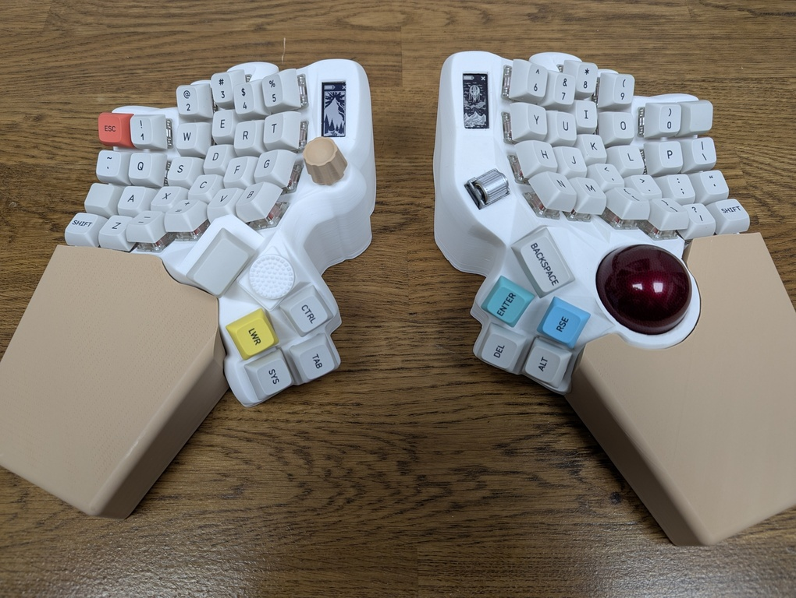

# Dmhuisma Keyboard ZMK Module

This is my ZMK module for the split keyboard I generated with the [Cosmos keyboard generator](https://ryanis.cool/cosmos/). This is still a work in progress, the left side is finished but I have to remake the right side due to issues I have been having with assembling the trackball.

The dpad, as configured here by cosmos, is not very good. The ALPS 5 way switch is not suitable for gaming use. It is very mushy and cannot do diagonal directions properly. I have made some custom modifications, as shown in [DPAD.md](DPAD.md)

The cosmos generator configuration is saved in the URL, here is [my configuration](https://ryanis.cool/cosmos/beta#cm:Ct8BChUSBRCAbyAnEgASABIAOB5AgIaLoAIKHhIFEIBjICcSABIAEgMQsDsSAxCwazgKQIDITUi0AwogEgUQgFcgJxIAEgASAxCwLxIDELBfOAlAgOCHuAJItAMKDxIFEIBLICcSABIAEgA4HQoPEgUQgD8gJxIAEgASADgxCikSEhBAICdAqI6HmAZIs5H0vOHQARIPCBNAl+qWGEi5nZSt4b4FMB04RQooEgggJ2IEVEVSTRIDEJB3EgQQoM4KEgkQMGIFU0hJRlQ4MkCAhougAhgAQK6Ql/gqSN6HgPSgNQqaAQp7EhYIgDAQwIACIABAi4XYlhBIjYWAwN0NEhgIloCoARBAIABA9onorZAOSLGjuPeA+gcSDyAAQK2F3ANImYmEnuDcEBIQIABA4oPY0AFI6ZOcl6DwERIPIABAz+KPOEiDj5yXoL0SEhEgAEDwhbyXsAFI4Z3MjcDYEjgAGAIiCgjIARDIARgAIABA15HMrPAzSKap4MbwswgK0wEKFRIFEIADICcSABIAEgA4HUCAhougAgoYEgUQgA8gJxIAEgASABIAOAlAgMhNSLQDChoSBRCAGyAnEgASABIAEgA4CkCA4Ie4Aki0AwoPEgUQgCcgJxIAEgASADgeCg8SBRCAMyAnEgASABIAODIKKRISEEAgJ0CnjoeYBkizkfi80dABEg8IG0CAqo74BEilkdC9gXYwHThGCigSByAnYgNFU0MSBBCQwAESBBCggAoSCRAwYgVTSElGVDgxQICGi6ACGAFArZCX+CpI3of875A1CrgBCpgBEhUIHBBAIABA2IOglcAMSM6DuI6g1QESGAiAMCAAQJn4lghIhI+AsKwBYgVTcGFjZRIYEEAgAECuhdwDSJmJiJ7Q3BBiBU1PVVNFEhcQQCAAQOGD2NABSOmToJeQ8BFiA1RBQhIXEEAgAEDQ4o84SIOPoJeQvRJiBE1FVEESFxBAIABA74W8l7ABSIWf0I2w2BJiAkZOOAAYAyIKCMgBEMgBGAAgAEDYkcys8DNIpqncxoC0CBiNICIFIKALKBwwHoIBAQNYSGADchMoMjgKQBRY4gmIAeIJYIQHcNAFePSHnKXxOA==). It also provides the BOM for this keyboard, I only added the MCP23017 GPIO expander board, in addition to my dpad changes.

## Features
- Ergonomic
    - Split
    - Concave key well
    - Thumb clusters
    - Staggered to accommodate my hand/finger sizes
- Wireless
- Enhanced ShockBurst (ESB) protocol instead of BLE for enhanced responsiveness, courtesy of [zmk-feature-split-esb](https://github.com/badjeff/zmk-feature-split-esb).
- Trackball mouse movement, with pointer acceleration for accuracy.
- Displays
- Hotswappable keys
- Dongle with display ([custom display layout](https://github.com/dmhuisma/zmk-dongle-display))
- Multiple potentiometers (one with directional clicking) for media controls, mouse scrolling, etc.
- Dpad for cursor navigation or gaming (see [DPAD.md](DPAD.md))

## Building

The firmware is built by Github actions on every commit. It can also be built with a local install of ZMK with the following commands.

> west build -p auto -d build/left -b nice_nano_v2 -- -DZMK_EXTRA_MODULES="[path to module]/dmhuisma-keyboard-zmk-module;[path to module]/zmk-feature-split-esb;[path to module]/zmk-feature-split-esb/nrf;[path to module]/zmk-feature-split-esb/nrfxlib;[path to module]/nice-view-battery" -DSHIELD="dmhuisma_left nice_view_battery"

> west build -p auto -d build/right -b nice_nano_v2 -- -DZMK_EXTRA_MODULES="[path to module]/dmhuisma-keyboard-zmk-module;[path to zmk-pmw3610-driver]/zmk-pmw3610-driver;[path to module]/zmk-feature-split-esb;[path to module]/zmk-feature-split-esb/nrf;[path to module]/zmk-feature-split-esb/nrfxlib;[path to module]/nice-view-battery" -DSHIELD="dmhuisma_right nice_view_battery"

> west build -p auto -d build/dongle -b seeeduino_xiao_ble -S studio-rpc-usb-uart -- -DZMK_EXTRA_MODULES="[path to module]/dmhuisma-keyboard-zmk-module;[path to module]/zmk-feature-split-esb;[path to module]/zmk-feature-split-esb/nrf;[path to module]/zmk-feature-split-esb/nrfxlib;[path to module]/zmk-pointing-acceleration-alpha;[path to module]/zmk-dongle-display" -DSHIELD="dmhuisma_dongle dongle_display"

If building locally, the following external zmk modules are required on your machine:

- [zmk-pmw3610-driver](https://github.com/badjeff/zmk-pmw3610-driver) (for the right side only)
- [zmk-feature-split-esb](https://github.com/badjeff/zmk-feature-split-esb) (some extra setup steps required, refer to the repo)
- [nice-view-battery](https://github.com/dmhuisma/nice-view-battery) (I forked this to get it to work with ESB, but it always shows that the keyboard is connected even if it is not)
- [zmk-pointing-acceleration-alpha](https://github.com/nuovotaka/zmk-pointing-acceleration-alpha)
- [zmk-dongle-display](https://github.com/dmhuisma/zmk-dongle-display) (I forked this to achieve a custom layout)

## Keyscan Matrix

## Pinout

This keyboard uses the [nice!nano V2](https://nicekeyboards.com/nice-nano/) on each side. However, there is not enough GPIO pins for this keyboard, so it also uses an MCP23017 GPIO expander.

### Left Keyboard

#### Nice!Nano V2 Left Side GPIO
|                       |                                               |
|-----------------------|-----------------------------------------------|
|Battery-               ||
|**[D1]** P0.06         |RKJXT1F42001 Encoder A|
|**[D0]** P0.08         |RKJXT1F42001 Encoder B|
|GND                    |NiceView GND|
|GND                    |MCP23017 GND, RKJXT1F42001 GND|
|**[D2]** P0.17         |RKJXT1F42001 center|
|**[D3]** P0.20         |MCP23017 RESET|
|**[D4]** P0.22         |MCP23017 SCL|
|**[D5]** P0.24         |MCP23017 SDA|
|**[D6]** P1.00         |NiceView MOSI|
|**[D7]** P0.11         |NiceView SCK|
|**[D8]** P1.04         |NiceView CS|
|**[D9]** P1.06         |MCP23017 INT|

#### Nice!Nano V2 Right Side GPIO
|                       |                                               |
|-----------------------|-----------------------------------------------|
|Battery+               ||
|Battery+               ||
|GND                    |DPAD GND|
|Reset                  ||
|3.3V Vcc               |NiceView Vcc, MCP23017 Vcc|
|**[D21]** P0.31 (ADC)  ||
|**[D20]** P0.29 (ADC)  ||
|**[D19]** P0.02 (ADC)  ||
|**[D18]** P1.15        |DPAD up|
|**[D15]** P1.13        |DPAD down|
|**[D14]** P1.11        |DPAD left|
|**[D16]** P0.10        |DPAD right|
|**[D10]** P0.09        ||

#### Nice!Nano V2 Back GPIO
|                       |                                               |
|-----------------------|-----------------------------------------------|
|P1.01                  ||
|P1.02                  ||
|P1.07                  ||

#### MCP23017 GPIO
|                       |                                               |
|-----------------------|-----------------------------------------------|
|PA0                    |Row 1|
|PA1                    |Row 2|
|PA2                    |Row 3|
|PA3                    |Row 4|
|PA4                    |Row 5|
|PA5                    |Row 6|
|PA6                    |Column 1|
|PA7                    |Column 2|
|PB0                    |Column 3|
|PB1                    |Column 4|
|PB2                    |Column 5|
|PB3                    |Column 6|
|PB4                    |RKJXT1F42001 up|
|PB5                    |RKJXT1F42001 down|
|PB6                    |RKJXT1F42001 left|
|PB7                    |RKJXT1F42001 right|

### Right Keyboard

#### Nice!Nano V2 Left Side GPIO
|                       |                                               |
|-----------------------|-----------------------------------------------|
|Battery+               ||
|**[D1]** P0.06         ||
|**[D0]** P0.08         |PMW3610 SDIO|
|GND                    |NiceView GND|
|GND                    |MCP23017 GND, PMW3610 GND|
|**[D2]** P0.17         |PMW3610 SCK|
|**[D3]** P0.20         |MCP23017 RESET|
|**[D4]** P0.22         |MCP23017 SCL|
|**[D5]** P0.24         |MCP23017 SDA|
|**[D6]** P1.00         |NiceView MOSI|
|**[D7]** P0.11         |NiceView SCK|
|**[D8]** P1.04         |NiceView CS|
|**[D9]** P1.06         |MCP23017 INT|

#### Nice!Nano V2 Right Side GPIO
|                       |                                               |
|-----------------------|-----------------------------------------------|
|Battery+               ||
|Battery+               ||
|GND                    |EVQWGD001 GND|
|Reset                  ||
|3.3V Vcc               |NiceView Vcc, MCP23017 Vcc, PMW3610 Vcc|
|**[D21]** P0.31 (ADC)  ||
|**[D20]** P0.29 (ADC)  ||
|**[D19]** P0.02 (ADC)  ||
|**[D18]** P1.15        |PMW3610 CS|
|**[D15]** P1.13        |PMW3610 IRQ/MOT|
|**[D14]** P1.11        |EVQWGD001 Encoder A|
|**[D16]** P0.10        |EVQWGD001 Encoder B|
|**[D10]** P0.09        |EVQWGD001 Button|

#### Nice!Nano V2 Back GPIO
|                       |                                               |
|-----------------------|-----------------------------------------------|
|P1.01                  ||
|P1.02                  ||
|P1.07                  ||

#### MCP23017 GPIO
|                       |                                               |
|-----------------------|-----------------------------------------------|
|PA0                    |Row 1|
|PA1                    |Row 2|
|PA2                    |Row 3|
|PA3                    |Row 4|
|PA4                    |Row 5|
|PA5                    |Row 6|
|PA6                    |Column 1|
|PA7                    |Column 2|
|PB0                    |Column 3|
|PB1                    |Column 4|
|PB2                    |Column 5|
|PB3                    |Column 6|
|PB4                    ||
|PB5                    ||
|PB6                    ||
|PB7                    ||

### Nice!Nano V2 pinout for reference

### MCP23017 pinout for reference

This is for the board I used, any other one should also work.

